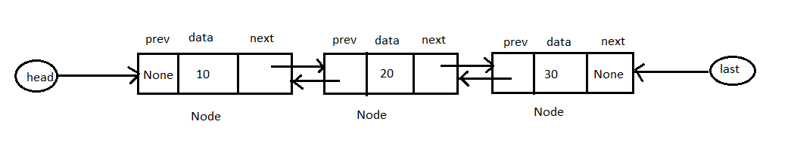
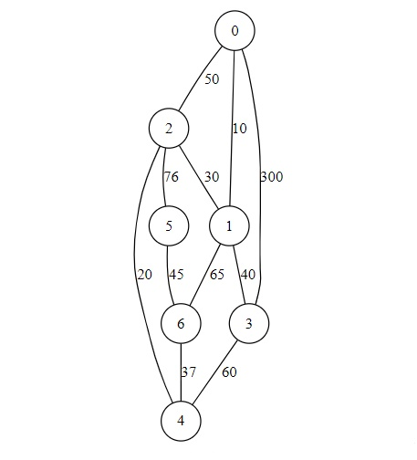
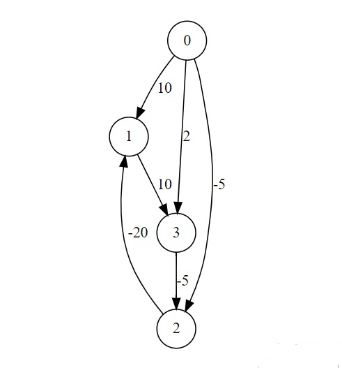

# PDSA - Scaler Coding Companion Problems

[TOC]

## Problem 1: IIT Madras - Linked List

A **doubly linked list** is a linked data structure that consists of two header nodes that point to the first and last position in a sequence of linked records. Each node in the sequence contains three fields: One data field and two link fields (references to the previous and to the next node in the sequence of nodes) and. So, it can be traversed in both directions.

For the given class **doubly_linked_list**, create two methods:

- **insert_end(data):** that accepts an integer `data` and inserts it into the list at the last position.
- **delete_end():** Delete one element of the list from the last position.

**Note-** Use given linked list structure to implementation. Write both operations (`insert_end` and `delete_end`) with **O(1)** time.

```python
class Node:
    def __init__(self, data):
        self.data = data # Stores data
        self.next = None # Contains the reference of next node
        self.prev = None # Contains the reference of previous node
class doubly_linked_list:
    def __init__(self):
        self.head = None # Contains the reference of first node of the list
        self.last = None # Contains the reference of the last node of the list
```

**Example**



**Sample Input**

```python
[1,3,5,7,9] # Elements for insert in list one by one, start from 1
2 # Perform delete_end operation two times
```

**Output**

```python
1,3,5 # Traversed list from head to last after deleting two elements
5,3,1 # Traversed list from last to head after deleting two elements
```

### Solution

**Prefix code(visible)**

```python
class Node:
    def __init__(self, data):
        self.data = data
        self.next = None
        self.prev = None
class doubly_linked_list:
    def __init__(self):
        self.head = None
        self.last = None
```

**Solution code**

```python
   def insert_end(self,data):
        newnode = Node(data)
        newnode.prev = self.last
        if self.head == None:
            self.head = newnode
            self.last = newnode
        else:
            self.last.next = newnode
            self.last = newnode

    def delete_end(self):
        if(self.head != None):
            if self.head == self.last:
                self.head = None
                self.last = None
            else:
                self.last = self.last.prev
                self.last.next = None
```

**Suffix code(visible)**

```python
    def traverse(self):
        temp = self.head
        while temp != None:
            if temp.next != None:
                print(temp.data, end=',')
            else:
                print(temp.data)
            temp = temp.next

    def traverse_rev(self):
        temp = self.last
        while temp != None:
            if temp.prev != None:
                print(temp.data, end=',')
            else:
                print(temp.data)
            temp = temp.prev


ins = eval(input())
delt = int(input())
A = doubly_linked_list()
for i in ins:
  A.insert_end(i)
for j in range(delt):
    A.delete_end()
A.traverse()
A.traverse_rev()
```

**Public Test Cases**

Input 1

```
[1,3,5,7,9]
2
```

Output

```
1,3,5
5,3,1
```

Input 2

```
[1,2,3,4,5,6,7,8,9,10]
5
```

Output

```
1,2,3,4,5
5,4,3,2,1
```

Input 3

```
[0, 1, 2, 3, 4, 5, 6, 7, 8, 9, 10, 11, 12, 13, 14, 15, 16, 17, 18, 19, 20, 21, 22, 23, 24, 25, 26, 27, 28, 29, 30, 31, 32, 33, 34, 35, 36, 37, 38, 39, 40, 41, 42, 43, 44, 45, 46, 47, 48, 49, 50, 51, 52, 53, 54, 55, 56, 57, 58, 59, 60, 61, 62, 63, 64, 65, 66, 67, 68, 69, 70, 71, 72, 73, 74, 75, 76, 77, 78, 79, 80, 81, 82, 83, 84, 85, 86, 87, 88, 89, 90, 91, 92, 93, 94, 95, 96, 97, 98, 99]
60
```

Output

```
0,1,2,3,4,5,6,7,8,9,10,11,12,13,14,15,16,17,18,19,20,21,22,23,24,25,26,27,28,29,30,31,32,33,34,35,36,37,38,39
39,38,37,36,35,34,33,32,31,30,29,28,27,26,25,24,23,22,21,20,19,18,17,16,15,14,13,12,11,10,9,8,7,6,5,4,3,2,1,0
```

<div style="page-break-after: always; break-after: page;"></div>

## Problem 2: IIT Madras - Restaurant Dishes

A restaurant always prepares dishes with the most orders before others with a lesser number of orders. Each dish in the restaurant menu has a unique integer ID. The restaurant receives `n` orders in a particular time period. The task is to find out the order of dish IDs according to which the restaurant will prepare them. Assume that restaurant has the following unique dish IDs in its menu:

`[1001, 1002, 1003, 1004, 1005, 1006, 1007, 1008, 1009]`

Write a function **DishPrepareOrder(order_list)** that accepts `order_list` in the form of a list of dish IDs and returns a list of dish IDs in the order in which the restaurant will prepare them. If two or more dishes have the same number of orders, then the dish which has a smaller ID value will be prepared first.

**Sample input**

```
[1004,1003,1004,1003,1004,1005,1003,1004,1003,1002,1005,1002,1002,1001,1002,1002,1002]
```

**Output**

```
[1002, 1003, 1004, 1005, 1001]
```

### Solution

```python
def insertionsort(L): #use this because it is stable sort
    n = len(L)
    if n < 1:
        return(L)
    for i in range(n):
        j = i
        while(j > 0 and L[j][1] > L[j-1][1]):
            (L[j],L[j-1]) = (L[j-1],L[j])
            j = j-1
    return(L)


def DishPrepareOrder(order_list):
    order_count = {}
    R = []
    for order in order_list:
        if order in order_count:
            order_count[order] += 1
        else:
            order_count[order] = 1
    for ID in sorted(order_count.keys()):
        R.append((ID,order_count[ID]))
    R=insertionsort(R)
    Res = []
    for tup in R:
        Res.append(tup[0])
    return Res
```

**Suffix Code(visible)**

```python
nums = eval(input())
print(DishPrepareOrder(nums))
```

**Public Test Cases**

Input 1

```
[1006, 1008, 1009, 1008, 1007, 1005, 1008, 1001, 1003, 1009, 1006, 1003, 1004, 1002, 1008, 1005, 1004, 1007, 1006, 1002, 1002, 1001, 1004, 1001, 1003, 1007, 1007, 1005, 1004, 1002]
```

Output

```
[1002, 1004, 1007, 1008, 1001, 1003, 1005, 1006, 1009]
```

Input 2

```
[1002, 1004, 1005, 1004, 1003, 1009, 1001, 1006, 1002, 1007, 1004, 1002, 1001, 1009, 1006, 1001, 1003, 1009, 1003, 1005, 1006, 1005, 1003, 1008, 1005, 1004, 1003, 1009, 1002, 1008, 1001, 1008, 1003, 1001, 1001, 1007, 1002, 1005, 1009, 1007, 1004, 1005, 1009, 1008, 1009, 1009, 1002, 1008, 1002, 1006, 1005, 1006, 1009, 1007, 1008, 1005, 1002, 1006, 1006, 1001, 1002, 1005, 1003, 1003, 1005, 1001, 1004, 1004, 1001, 1009, 1005, 1008, 1001, 1008, 1006, 1001, 1001, 1009, 1002, 1001, 1003, 1004, 1009, 1008, 1004, 1006, 1003, 1009, 1007, 1005, 1004, 1009, 1001, 1009, 1007, 1004, 1008, 1005, 1004, 1008]
```

Output

```
[1009, 1001, 1005, 1004, 1008, 1002, 1003, 1006, 1007]
```

Input 3

```
[1009, 1001, 1005, 1004, 1008, 1002, 1003, 1006, 1007]
```

Output

```
2[1001, 1002, 1003, 1004, 1005, 1006, 1007, 1008, 1009]
```

**Private Test Cases**

Input 1

```
[1003, 1002, 1004, 1005, 1005, 1008, 1006, 1001, 1002, 1001, 1003, 1006, 1006, 1006, 1007, 1002, 1009, 1003, 1006, 1005, 1008, 1006, 1005, 1006, 1002, 1003, 1006, 1004, 1004, 1006, 1004, 1001, 1004, 1005, 1002, 1008, 1001, 1003, 1009, 1003, 1006, 1001, 1009, 1001, 1008, 1001, 1009, 1007, 1002, 1004]
```

Output

```
[1006, 1001, 1002, 1003, 1004, 1005, 1008, 1009, 1007]
```

Input 2

```
[1006, 1007, 1005, 1006, 1003, 1009, 1001, 1005, 1007, 1007, 1004, 1008, 1002, 1002, 1006, 1001, 1006, 1003, 1001, 1006, 1007, 1002, 1005, 1003, 1007, 1007, 1001, 1008, 1007, 1005, 1003, 1005, 1001, 1005, 1003, 1003, 1004, 1001, 1007, 1006, 1006, 1007, 1006, 1008, 1009, 1004, 1005, 1002, 1006, 1002, 1002, 1003, 1007, 1007, 1004, 1006, 1006, 1001, 1004, 1004, 1006, 1007, 1008, 1006, 1004, 1002, 1008, 1002, 1008, 1006, 1007, 1007, 1006, 1008, 1002, 1004, 1004, 1008, 1005, 1001, 1007, 1003, 1005, 1007, 1006, 1001, 1002, 1004, 1001, 1008, 1001, 1007, 1007, 1001, 1005, 1003, 1009, 1007, 1004, 1006, 1001, 1002, 1005, 1006, 1003, 1003, 1006, 1001, 1005, 1003, 1005, 1005, 1004, 1006, 1005, 1002, 1005, 1006, 1005, 1003, 1006, 1006, 1001, 1003, 1009, 1009, 1005, 1003, 1008, 1005, 1006, 1008, 1004, 1002, 1008, 1001, 1009, 1008, 1009, 1009, 1003, 1007, 1009, 1005, 1003, 1006, 1008, 1007, 1001, 1008, 1009, 1006, 1004, 1002, 1004, 1006, 1001, 1002, 1007, 1008, 1003, 1002, 1004, 1008, 1009, 1006, 1002, 1004, 1004, 1006, 1001, 1001, 1006, 1002, 1009, 1005, 1004, 1005, 1009, 1006, 1008, 1001, 1009, 1001, 1002, 1004, 1003, 1003, 1007, 1001, 1006, 1006, 1006, 1001, 1001, 1005, 1003, 1001, 1001, 1007]
```

Output

```
[1006, 1001, 1007, 1005, 1003, 1004, 1002, 1008, 1009]
```

Input 3

```
[1006, 1007, 1004, 1005, 1007, 1008, 1001, 1006, 1002, 1006]
```

Output

```
[1006, 1007, 1001, 1002, 1004, 1005, 1008]
```

Input 4

```
[1006, 1003, 1005, 1009, 1008]
```

Output

```
[1003, 1005, 1006, 1008, 1009]
```

Input 5

```
[1003, 1003, 1003, 1003, 1003, 1003, 1003, 1003, 1003, 1003, 1003, 1003, 1003, 1003, 1003, 1003, 1003, 1003, 1003, 1003]
```

Output

```
[1003]
```

<div style="page-break-after: always;"></div>

## Problem 3: IIT Madras - Water Tanks on a Hill

Consider a system of `n` water tanks on a hill, connected via `m` pipes. Water can flow through these pipes only in one direction. We have a source of water that can be connected to only one of these water tanks. We need to find if there exists a master tank such that all the tanks in this group can be filled by connecting the water source to this master tank. The tanks are numbered from `1` to `n`.

Write a Python function **`findMasterTank(tanks, pipes)`** that accepts arguments `tanks` which is a list of tanks, and `pipes` which is a list of tuples that represents connectivity through pipes, between tanks. Each tuple `(i,j)` in `pipes` represents a pipe such that, water can flow from tank `i` to tank `j` but not vice versa. Your function should find a master tank and return the number representing it, else should return `0` if no master tank exists in the system. If there are more than one master tanks return any one of them. Try to implement an algorithm that executes in linear time ($O(n+m)$).

**Sample input:**

```python
1 2 3 4 # Vertices
3		# Number of edges
1 2		# edge
2 3     # edge
2 4     # edge
```

**Return:**

```
1
```

### **_Solution:_**

```python
from collections import deque
class myStack:
  def __init__(self):
    self.stack = deque()

  def pop(self):
    return self.stack.pop()

  def push(self, x):
    return self.stack.append(x)


  def isEmpty(self):
    return False if self.stack else True


# Run depth first search starting from vertex t and mark all nodes that are visited.
def runDFSForTankT(tanks, GList, t, visited):
  s = myStack()
  s.push(t)
  visited[t] = True


  while not s.isEmpty():
    i = s.pop()
    for p in GList[i]:
      if not visited[p]:
        s.push(p)
        visited[p] = True

# Time complexity for this approach will be O(n(n+m)).
# Below function finds the master tank in O(n+m) time complexity. Here v is number of vertices and e is number of edges.
def findMasterTank(tanks, pipes):
  # Create an adjacency list for graph representing the system of pipes and tanks.
  GList = {}
  for i in tanks:
    GList[i]=[]
  for (i,j) in pipes:
    GList[i].append(j)


  # Mark every tank not visited.
  visited = {t:False for t in tanks}

  lastVisited = tanks[0]
  # Traverse the tanks through depth first search method and keep track of last visited tank.
  for t in tanks:
    if not visited[t]:
      runDFSForTankT(tanks, GList, t, visited)
      lastVisited = t


  # Check if this last visited tank has paths to all other tanks in the system by doing another depth first search.
  visited = {t:False for t in tanks}
  runDFSForTankT(tanks, GList, lastVisited, visited)


  # Check visited to verify if all tanks are visited.
  for v in visited:
    if not visited[v]:
      return 0
  return lastVisited

```

**Suffix**

```python
v = [item for item in input().split(" ")]
numberOfEdges = int(input())
e = []
for i in range(numberOfEdges):
  s = input().split(" ")
  e.append((s[0], s[1]))
print(findMasterTank(v, e))
```

**Public Test Case 1**

**Input**

```
1 2 3 4
3
1 2
2 3
2 4
```

**Output**

```
1
```

**Public Test Case 2**

**Input**

```
1 2 3 4 5 6 7
9
1 3
2 3
3 6
4 6
4 7
6 2
7 5
5 1
5 6
```

**Output**

```
4
```

<div style="page-break-after: always; break-after: page;"></div>

## Problem 4: IIT Madras - XYZ Courier Service

A courier company **XYZ** provides courier service between `n` cities labeled `0` to `n-1`, where customer can send the item from any city to any another city. The company follows the shortest path to deliver items and charges `5 Rs.` per kilometer. The company wants to develop an inquiry system where customers can get the information on the cost and route for their courier.

Write a class **XYZ_Courier** that accepts a weighted adjacency list `Route_map` for an undirected and connected graph at the time of object creation in following format:-

```
Route_map = {
   	source_index : [(destination_index,distance),(destination_index,distance),..],
    ..
    ..
    source_index : [(destination_index,distance),(destination_index,distance),..]
}
```

The class has following methods:-

- `cost(source, destination)` that accepts source name and destination name and returns minimum cost for delivery.

- `route(source, destination)` that accepts source name and destination name and returns the shortest route for delivery in the following format:

  `[source, place1, place2, ..., destination]`

**For the given graph**



Sample input 1

```python
7 # number of vertices
[(0,1,10),(0,2,50),(0,3,300),(5,6,45),(2,1,30),(6,4,37),(1,6,65),(2,5,76),(1,3,40),(3,4,60),(2,4,20)] # edges
0 #source
4 #destination
```

Output

```python
300 #cost
[0, 1, 2, 4] #route
```

Sample input 2

```python
7
[(0,1,10),(0,2,50),(0,3,300),(5,6,45),(2,1,30),(6,4,37),(1,6,65),(2,5,76),(1,3,40),(3,4,60),(2,4,20)] #
2
6
```

Output

```
285
[2, 4, 6]
```

### Solution

**Solution Code**

```python
class XYZ_Courier:
    def __init__(self,Route_map):
        self.Route_map = Route_map
    def dijkstra(self,WList,s):
        infinity = 1 + len(WList.keys())*max([d for u in WList.keys()for (v,d) in WList[u]])
        (visited,distance,prev) = ({},{},{})
        for v in WList.keys():
            (visited[v],distance[v],prev[v]) = (False,infinity,None)
        distance[s] = 0
        for u in WList.keys():
            nextd = min([distance[v] for v in WList.keys() if not visited[v]])
            nextvlist = [v for v in WList.keys() if (not visited[v]) and distance[v] == nextd]
            if nextvlist == []:
                break
            nextv = min(nextvlist)
            visited[nextv] = True
            for (v,d) in WList[nextv]:
                if not visited[v]:
                    if distance[v] > distance[nextv]+d:
                        distance[v] = distance[nextv]+d
                        prev[v] = nextv
        return(distance,prev)


    def cost(self,source,destination):
        distance,path = self.dijkstra(self.Route_map, source)
        return 5 * distance[destination]

    def route(self,source,destination):
        distance,path = self.dijkstra(self.Route_map, source)
        Route=[]
        if distance[destination]!=0:
            dest = destination
            while dest != source:
                Route = [dest] + Route
                for i,j in path.items():
                    if dest == i:
                        dest = j
                        break
            Route = [dest] + Route
        return Route
```

**Suffix Code**(visible)

```python
size = int(input())
edges = eval(input())
s=int(input())
d=int(input())
WL = {}
for i in range(size):
    WL[i] = []
for ed in edges: #for create list for undirected graph
    WL[ed[0]].append((ed[1],ed[2]))
    WL[ed[1]].append((ed[0],ed[2]))

C = XYZ_Courier(WL)
print(C.cost(s,d))
print(C.route(s,d))
```

**Public Test Case 1**

**Input**

```
7
[(0,1,10),(0,2,50),(0,3,300),(5,6,45),(2,1,30),(6,4,37),(1,6,65),(2,5,76),(1,3,40),(3,4,60),(2,4,20)]
0
4
```

**Output**

```
300
[0, 1, 2, 4]
```

**Public Test Case 2**

**Input**

```
7
[(0,1,10),(0,2,50),(0,3,300),(5,6,45),(2,1,30),(6,4,37),(1,6,65),(2,5,76),(1,3,40),(3,4,60),(2,4,20)] #
2
6
```

**Output**

```
285
[2, 4, 6]
```

<div style="page-break-after: always; break-after: page;"></div>

## Problem 5: IIT Madras - Minimum Cost Walk

Write a Function **min_cost_walk(WList, S, D, V)** that accepts a weighted adjacency list `WList` for a undirected and connected graph. The function returns the minimum cost and walk route in the format `(minimum_cost, [walk_route])` from node **S** to node **D**, via node **V** (`S -> V -> D`), where the cost of a walk is the sum of weights of edges encountered on the route.

**Note:-** Node can be repeat in path.

**For the given graph**


**Sample Input 1**

```python
7 # number of vertices
[(0,1,10),(0,2,50),(0,3,300),(5,6,45),(2,1,30),(6,4,37),(1,6,65),(2,5,76),(1,3,40),(3,4,60),(2,4,20)] # edges
0 #S
4 #D
5 #V
```

**Output**

```
(198, [0, 1, 2, 5, 6, 4])
```

### Solution

```python
def dijkstra(WList,s):
    infinity = 1 + len(WList.keys())*max([d for u in WList.keys()for (v,d) in WList[u]])
    (visited,distance,prev) = ({},{},{})
    for v in WList.keys():
        (visited[v],distance[v],prev[v]) = (False,infinity,None)
    distance[s] = 0
    for u in WList.keys():
        nextd = min([distance[v] for v in WList.keys() if not visited[v]])
        nextvlist = [v for v in WList.keys() if (not visited[v]) and distance[v] == nextd]
        if nextvlist == []:
            break
        nextv = min(nextvlist)
        visited[nextv] = True
        for (v,d) in WList[nextv]:
            if not visited[v]:
                if distance[v] > distance[nextv]+d:
                    distance[v] = distance[nextv]+d
                    prev[v] = nextv
    return(distance,prev)


def min_cost_walk(WList,S, D, V):
    distance1,path1 = dijkstra(WList, S)
    distance2,path2 = dijkstra(WList, V)
    tot_dist = distance1[V] + distance2[D]
    Route_S_V = []
    Route_V_D = []
	# shortest route for S to V
    if distance1[V] != 0:
        dest = V
        while dest != S:
            Route_S_V = [dest] + Route_S_V
            for i,j in path1.items():
                if dest == i:
                    dest = j
                    break
        Route_S_V = [dest] + Route_S_V
  	# shortest route for V to D
    if distance2[D] != 0:
        dest = D
        while dest != V:
            Route_V_D = [dest] + Route_V_D
            for i,j in path2.items():
                if dest == i:
                    dest = j
                    break
        Route_V_D = [dest] + Route_V_D
    Route_S_D = Route_S_V[:-1]+ Route_V_D
    return (tot_dist,Route_S_D)
```

**Suffix Code(visible)**

```python
size = int(input())
edges = eval(input())
S= int(input())
D=int(input())
V=int(input())
WL = {}
for i in range(size):
    WL[i] = []
for ed in edges: #for create list for undirected graph
    WL[ed[0]].append((ed[1],ed[2]))
    WL[ed[1]].append((ed[0],ed[2]))
print(min_cost_walk(WL,S, D, V))
```

**Public Test case**

**Input 1**

```
7
[(0,1,10),(0,2,50),(0,3,300),(5,6,45),(2,1,30),(6,4,37),(1,6,65),(2,5,76),(1,3,40),(3,4,60),(2,4,20)]
0
4
5
```

**Output 1**

```
(198, [0, 1, 2, 5, 6, 4])
```

**Input 2**

```
7
[(0,1,10),(0,2,50),(0,3,300),(5,6,45),(2,1,30),(6,4,37),(1,6,65),(2,5,76),(1,3,40),(3,4,60),(2,4,20)]
0
4
3
```

**Output 2**

```
(110, [0, 1, 3, 4])
```

**Input 3**

```
7
[(0,1,10),(0,2,50),(0,3,300),(5,6,45),(2,1,30),(6,4,37),(1,6,65),(2,5,76),(1,3,40),(3,4,60),(2,4,20)]
1
4
0
```

**Output 3**

```
(70, [1, 0, 1, 2, 4])
```

<div style="page-break-after: always; break-after: page;"></div>

## Problem 6: Negative Weight Cycle

Write a function **IsNegativeWeightCyclePresent(WList)** that accepts a weighted adjacency list `WList` for a directed and connected graph and returns `True` if the graph has a negative weight cycle. Otherwise, return `False`.

**For Given Graph**



Sample Input

```python
4 # number of vertices
[(0,1,10),(0,2,-5),(0,3,2),(3,2,-5),(2,1,-20),(1,3,10)] # edges
```

Output

```python
True
```

For Given Graph


Sample Input

```python
4
[(0,1,10),(0,2,-5),(0,3,2),(3,2,-5),(2,1,-2),(1,3,10)]
```

Output

```python
False
```

### Solution

```python
def IsNegativeWeightCyclePresent(WList):
    s = 0
    infinity = 1 + len(WList.keys())*max([d for u in WList.keys() for (v,d) in WList[u]])
    distance = {}
    for v in WList.keys():
        distance[v] = infinity
    distance[s] = 0
    for i in WList.keys():
        for u in WList.keys():
            for (v,d) in WList[u]:
                distance[v] = min(distance[v], distance[u] + d)


    for u in WList.keys():
        for (v,d) in WList[u]:
            if (distance[u] + d < distance[v]):
                return True
    return False
```

**suffix code(visible)**

```python
size = int(input())
edges = eval(input())
WL = {}
for i in range(size):
    WL[i] = []
for ed in edges:
    WL[ed[0]].append((ed[1],ed[2]))

print(IsNegativeWeightCyclePresent(WL))
```

**Public Test case**

**Input 1**

```
4
[(0,1,10),(0,2,-5),(0,3,2),(3,2,-5),(2,1,-20),(1,3,10)]
```

**Output 1**

```
True
```

**Input 2**

```
4
[(0,1,10),(0,2,-5),(0,3,2),(3,2,-5),(2,1,-2),(1,3,10)]
```

**Output 2**

```
False
```

**Input 3**

```
4
[(0,1,-10),(1,2,-20),(2,3,-20)]
```

**Output 3**

```
False
```

## Problem 7: IIT Madras - K-th Minimum Greater Than

Write a Python function **KminGreaterThan(arr, k, num)**, that accepts an unsorted list `arr` , two numbers `k` and `num` , returns `True` if the `k`<sup> th</sup> smallest element in the list `arr` is greater than or equal to `num`, otherwise returns `False`. Try to write a solution that runs in $O(n\log{k})$ time.

```python
def KminGreaterThan(arr, k, num):
  #Complete this function
```

**Sample Input:**

```
66 55 43 34 12 7 2 20 5
5
18
```

**Sample Output**

```
True
```

**Sample Input:**

```
66 55 43 34 12 7 2 20 5
6
40
```

**Sample Output**

```
False
```

**_Solution:_**

```python
class max_heap:
  def __init__(self):
    self.size=0
    self.arr = []


  def isempty(self):
    return True if (self.size == 0) else False

  def max(self):
    return self.arr[0] if self.size>0 else None


  # Heapify element at index i
  def heapify_down(self, i):
    n = self.size
    a = self.arr
    while (i<n):
      gg = l = 2 * i + 1
      r = 2 * i + 2
      # gg is greater of left and right child
      if (l<n and r<n and a[l] < a[r]):
        gg = r
      if (gg<n and a[gg] > a[i]):
        a[i], a[gg] = a[gg], a[i]
        i = gg
      else:
        break


  def delete_max(self):
    max = self.arr[0]
    last = self.arr.pop()
    #size of heap after pop operation will reduce by 1
    self.size -= 1
    if (self.size > 0):
      self.arr[0] = last
      self.heapify_down(0)
    return max


  # Replace max element with x
  def replace_max(self, x):
    max = self.arr[0]
    self.arr[0] = x
    self.heapify_down(0)
    return max

  # Heapify last element in the heap
  def heapify_up(self):
    i = self.size - 1
    while (i>0):
      parent = (i-1)//2
      if (self.arr[i] > self.arr[parent]):
        self.arr[i], self.arr[parent] = self.arr[parent], self.arr[i]
        i = parent
      else:
        break

  # Insert to min heap
  def insert_max_heap(self, x):
    self.arr.append(x)
    self.size += 1
    self.heapify_up()


# This function first finds the kth smallest element and than compares it with x
def KminGreaterThan(arr, k, num):
  # Build max heap of size k
  h = max_heap()
  for i in range(k):
    h.insert_max_heap(L[i])


  # Insert the next element in the list if it is smaller than the max in heap.
  # This will ensure that the heap contains k minimum elements from the parsed elements.
  for i in range(k, len(arr)):
    if (h.max() > arr[i]):
      h.replace_max(arr[i])
  return True if (h.max() >= num) else False
```

**Another good solution**

```python
def min_heapify(li,i):
  lchild = 2*i + 1
  rchild = 2*i + 2
  small = i
  if lchild < len(li) and li[lchild] < li[small]:
    small = lchild
  if rchild < len(li) and li[rchild] < li[small]:
    small = rchild
  if small != i:
    (li[small],li[i]) = (li[i], li[small])
    min_heapify(li,small)
def create_heap(li):
  for x in range((len(li)//2)-1,-1,-1):
    min_heapify(li,x)
  return li
def delete_root(li):
  li[-1],li[0] = li[0],li[-1]
  temp = li.pop()
  min_heapify(li,0)
  return temp
def KminGreaterThan(arr,k,num):
  arr = create_heap(arr)
  for x in range(k):
    deleted_val = delete_root(arr)
  return deleted_val > num
```

**Suffix**

```python
L = [int(item) for item in input().split(" ")]
k = int(input())
num = int(input())
print(KminGreaterThan(L, k, num))
```

<div style="page-break-after: always;"></div>

**Public Test case 1**

**Input 1**

```
1 10 11 12 15 23 31 34 61 64 65 72 84 92 96
4
30
```

**Output 1**

```
False
```

**Public Test case 2**

**Input 2**

```
77 97 109 147 155 160 188 191 205 206 217 242 252 286 289 294 308 312 335 375 393 402 405 455 456
10
78
```

**Output 2**

```
True
```

<div style="page-break-after: always;"></div>

## Problem 8: IIT Madras - Heap Sort

Function **heapSort(arr)** sorts the array `arr` using max heap. Complete the function **heapify(arr, n, i)**, that takes three arguments, `arr` is the max heap array, `n` is the number of elements in heap `arr` and `i` is the index of element that needs to be heapified and heapifies the array from index `0` to `n-1` with respect to element at index`i`.

```python
def heapify(arr, n, i):
  #Complete this function


def heapSort(arr):
    n = len(arr)
    for i in range(n//2, -1, -1):
        heapify(arr, n, i)
    for i in range(n-1, 0, -1):
        arr[i], arr[0] = arr[0], arr[i]
        heapify(arr, i, 0)
```

### sample input

```
45 23 6 12 9 1 22 58
```

### sample output

```
1 6 9 12 22 23 45 58
```

### **Solution**

```python
def heapify(arr, n, i):
    largest = i
    l = 2 * i + 1
    r = 2 * i + 2
    if l < n and arr[i] < arr[l]:
        largest = l
    if r < n and arr[largest] < arr[r]:
        largest = r
    if largest != i:
        arr[i], arr[largest] = arr[largest], arr[i]
        heapify(arr, n, largest)
```

**Suffix**

```python
def heapSort(arr):
    n = len(arr)
    for i in range(n//2, -1, -1):
        heapify(arr, n, i)
    for i in range(n-1, 0, -1):
        arr[i], arr[0] = arr[0], arr[i]
        heapify(arr, i, 0)


L = [int(item) for item in input().split(" ")]
heapSort(L)
print(*L)
```

**Public test case 2**

**Input**

```
45 23 6 12 9 1 22 58
```

**Output**

```
1 6 9 12 22 23 45 58
```

**Public test case 2**

**Input**

```
45 22 57 12 33 73 55 2 80 62
```

**Output**

```
2 12 22 33 45 55 57 62 73 80
```
